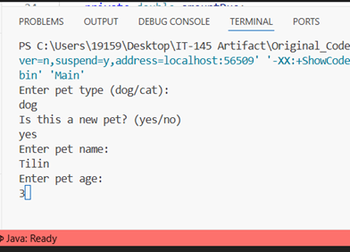
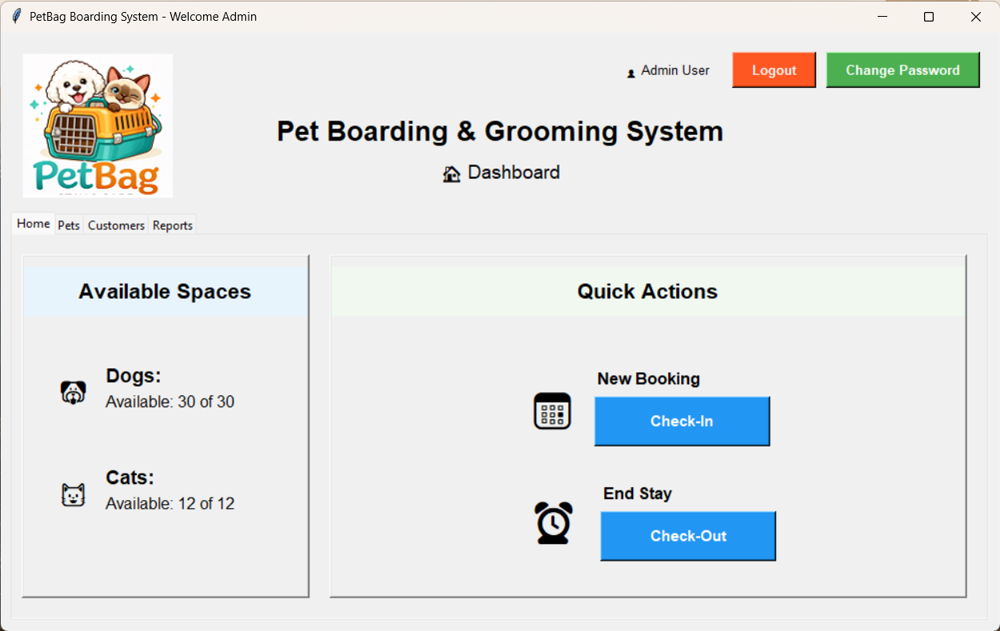
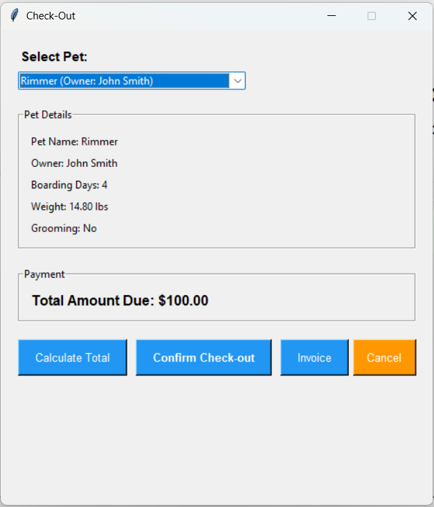
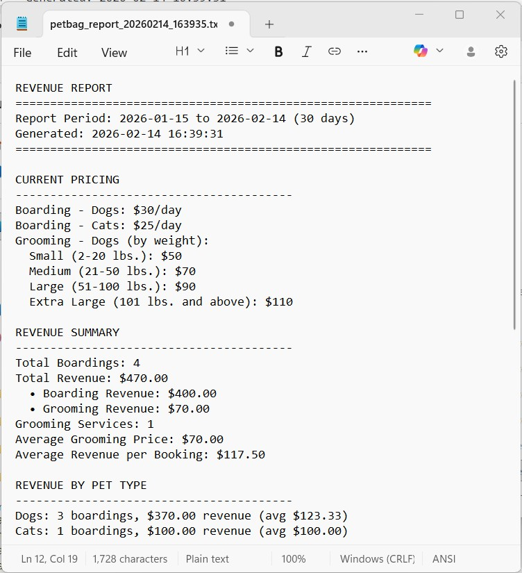
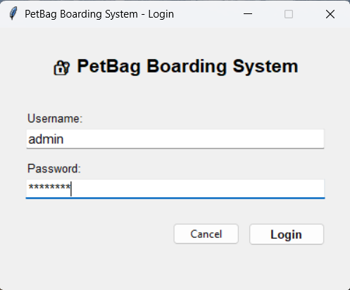

# ePortfolio
## Introduction
Hello,

_I’m Yana Burlak, a Computer Science student at SNHU. This ePortfolio presents my work enhancing the **PetBag Boarding and Grooming System** through three phases: Software Design and Engineering, Algorithms and Data Structures, and Databases. The original project began as a simple console-based Java program in IT-145 Introduction to Scripting. Throughout these phases, I transformed it into a full-featured, GUI-based application with persistent storage, more advanced business logic, and secure authentication._

_Each phase challenged me to revisit knowledge from previous courses and expand my understanding by learning new approaches and improving my development practices._

_I selected this artifact for my ePortfolio because it represents a complete and meaningful project that demonstrates my ability to design and develop a full-stack application from start to finish. The PetBag Boarding System shows my growth as a developer, especially as the project evolved beyond basic functionality into a more secure and structured application._

```
CODE REVIEW
```
Before starting the enhancements, I recorded a code review of the original Java application. In the video, I discussed its main limitations, including the lack of persistent storage, flat grooming pricing, no graphical user interface, and minimal error handling. You can watch the review here:

[Code Review link](./another-page.html).

```
ORIGINAL CODE & USER VIEW
```
The original **PetBag Application** was a command‑line program that prompted the user with a series of questions to accept a pet into the facility. Here's a screenshot of the interaction and link to the orginal code:



[Original Java Code](https://github.com/yburlak/ePortfolio/blob/master/Pet.java).

The program ran as expected, but it was not practical or professional enough for a small boarding business. For that reason, it became an ideal choice for my capstone project.

```
ENHANCEMENTS 
```

## Phase One: Software Design and Engineering

> My main goal for this phase was to migrate the application from Java to Python, build an intuitive graphical interface, and introduce a persistent database. I wanted to create a foundation that could support more complex features later.

Screenshot of the PetBag Boarding & Grooming system’s GUI, built using Python and Tkinter:



### Programming Language

I chose Python because of its rich ecosystem (Tkinter for GUI, mysql‑connector for database) and its readability, perfect for a project that would grow over time. Plus, Python's dynamic nature made it easy to prototype and refactor. 

The application was designed with small business owners in mind. It runs as a standalone system without the need for complex infrastructure or web hosting, making it a practical and cost-effective solution.

### GUI with Tkinter

I used Tkinter to create a tabbed interface (ttk.Notebook) with four main tabs: Home, Pets, Customers, and Reports. Each tab contains relevant widgets: Treeview for displaying data, Entry and Combobox for input, and Button for actions.

Here's a snippet from views.py that creates the Pets tab:
```python
def create_pet_section(self, parent):
    header_frame = tk.Frame(parent)
    header_frame.pack(fill=tk.X, pady=(10, 10))
    
    tk.Label(header_frame, text="🐕", font=("Arial", 20)).pack(side=tk.LEFT, padx=(0, 10))
    tk.Label(header_frame, text="Pet Management", font=("Arial", 24, "bold")).pack(side=tk.LEFT)
    
    button_frame = tk.Frame(parent)
    button_frame.pack(fill=tk.X, padx=10, pady=10)
    
    tk.Button(button_frame, text="Add Pet", command=self.controllers.add_pet,
              bg="#2196F3", fg="white", font=("Arial", 11)).pack(side=tk.LEFT, padx=(0, 10))
    
    # ... more buttons and Treeview setup
```
The Treeview widget was perfect for displaying lists of customers and pets, and binding double‑click events allowed editing directly.

### Basic Database Setup

I designed a rational database named **pet_bag_db** with four tables (Users table would be created later): 
 - Customer,
 - Pet, 
 - Boarding,  
 - Grooming.
  
The setup script (database/setup.py) creates these tables if they don't exist. 
 
Here's a snippet that creates the Boarding table:
 ```python
cursor.execute("""
    CREATE TABLE IF NOT EXISTS Boarding (
        boarding_id INT AUTO_INCREMENT PRIMARY KEY,
        pet_id INT NOT NULL,
        check_in DATE NOT NULL,
        check_out DATE,
        days_stay INT NOT NULL,
        amount_due DECIMAL(10,2) NOT NULL,
        grooming_requested BOOLEAN DEFAULT FALSE,
        FOREIGN KEY (pet_id) REFERENCES Pet(pet_id)
        ON DELETE CASCADE
    )
""")
```
I used ON DELETE CASCADE to automatically remove boarding records when a pet is deleted, this ensures data integrity without manual cleanup.

Each model class, including Customer and Pet, was provided with basic CRUD methods to support record creation, modification, and retrieval. Proper cascade deletion still required work and was scheduled for implementation in the next enhancement phase.

By the end of Phase 1, I had a working application with a clean interface and a solid database foundation that met some of the initial requirements of the CS‑499 capstone project.

## Phase Two: Algorithms and Data Structures

> In this enhancement phase, I wanted to add intelligent business logic: dynamic grooming pricing, real‑time space tracking, comprehensive reporting, and a proper architectural separation. This required careful algorithm design, the use of appropriate data structures, and refactoring into the MVC pattern.

### Data Structures 
Throughout this phase, I used:
- dictionaries for pricing tiers, configuration, and row data from the database.
- lists for dropdown values (age, days stay, report periods).
- tuples for parameterized SQL queries.

### MVC Architecture

I refactored the code into Models, Views, Controllers, and Services:
- Models (customer.py, pet.py) – encapsulate data and CRUD operations.
- Views (views.py) – handle all GUI components and user interaction.
- Controllers (controllers.py) – coordinate between models and views, containing high‑level workflow logic.
- Services (boarding_service.py, checkout_service.py, report_service.py) – complex business rules, separate from controllers.

This separation made the code much easier to maintain and test. 

### Grooming Pricing Tiers

The original Java version charged a flat $50 for grooming, regardless of dog size. I introduced weight‑based pricing using a dictionary of dictionaries that maps weight ranges to prices.

Here's a snippet with new pricing:
```python
GROOMING_PRICES = {
    'small':   {'min': 2,   'max': 20,  'price': 50},
    'medium':  {'min': 21,  'max': 50,  'price': 70},
    'large':   {'min': 51,  'max': 100, 'price': 90},
    'extra_large': {'min': 101, 'max': float('inf'), 'price': 110}
}
```
The calculate_grooming_price(weight) method iterates through the tiers to find the matching range:
```python
def calculate_grooming_price(weight):
    if weight < 2:
        return 0  # too small for grooming
    for tier, details in BoardingService.GROOMING_PRICES.items():
        if details['min'] <= weight <= details['max']:
            return details['price']
    return BoardingService.GROOMING_PRICES['extra_large']['price']
```
This simple loop has a time complexity of O(n), but since n is very small, performance is not an issue. The real advantage lies in maintainability: if the business owner decides to change prices, you only need to update the dictionary.

### Space Availability Tracking

To know how many spaces are available, I needed to count active boardings. I added a method in pet.py that queries the database for pets with no checkout date:

```python
def get_occupied_spaces(db):
    cursor = db.connection.cursor()
    cursor.execute("""
        SELECT p.pet_type, COUNT(*) as count 
        FROM Boarding b
        JOIN Pet p ON b.pet_id = p.pet_id
        WHERE b.check_out IS NULL
        GROUP BY p.pet_type
    """)
    results = cursor.fetchall()
    occupied = {'dog': 0, 'cat': 0}
    for pet_type, count in results:
        occupied[pet_type.lower()] = count
    return occupied
```
Then boarding_service.py calculates available spaces:

```python
def get_available_spaces(db):
    occupied = Pet.get_occupied_spaces(db)
    return {
        "dog_spaces": BoardingService.TOTAL_DOG_SPACES - occupied.get('dog', 0),
        "cat_spaces": BoardingService.TOTAL_CAT_SPACES - occupied.get('cat', 0)
    }
```
This real‑time calculation ensures users always see accurate capacity on the dashboard.

### Check-In & Check-Out

At the core of PetBag are two essential workflows: checking pets in and checking them out. I focused on making these processes clear and efficient because they directly impact space availability, revenue, and the data used for reporting. The dialogs I designed guide staff through each step, validate inputs, and provide immediate feedback. Everything else—customer records, pet management, and reports—supports or builds upon these core events. By ensuring these workflows are intuitive and reliable, I created a system that works smoothly in a busy boarding environment.

When the user clicks "Check‑In" on the Home tab, a dialog appears with fields for owner information, pet details, and stay preferences. The system validates every input, checks for available space, calculates charges (including grooming if requested), and creates the necessary database records. A success message summarizes the charges, and the dashboard updates in real time.

For checkout, another dialog lists all currently boarded pets. After selecting a pet, staff can view details, calculate the total, and either confirm checkout or generate an invoice. Upon confirmation, the boarding record is updated, the space is freed, and an invoice can be viewed or saved.

A screenshot of the check‑out dialog:



These two dialogs form the operational core of the application. Every other feature exists to support or analyze the data generated by these check-in and check-out events.

### Reporting

The report_service.py contains two major methods: get_occupancy_report and get_revenue_report. Both use SQL aggregation functions to summarize data over a user‑specified period (7, 30, 60, or 90 days).

Here's a snippet of the revenue report:
```sql
SELECT 
    DATE(b.check_in) as date,
    COUNT(*) as total_boardings,
    SUM(b.amount_due) as daily_revenue,
    SUM(CASE WHEN p.pet_type = 'dog' THEN b.amount_due ELSE 0 END) as dog_revenue,
    SUM(CASE WHEN p.pet_type = 'cat' THEN b.amount_due ELSE 0 END) as cat_revenue,
    SUM(CASE WHEN b.grooming_requested = 1 AND p.pet_type = 'dog' THEN 1 ELSE 0 END) as grooming_count,
    SUM(CASE WHEN g.price IS NOT NULL THEN g.price ELSE 0 END) as grooming_revenue
FROM Boarding b
JOIN Pet p ON b.pet_id = p.pet_id
LEFT JOIN Grooming g ON b.boarding_id = g.boarding_id
WHERE b.check_in BETWEEN %s AND %s
GROUP BY DATE(b.check_in)
```
This query uses conditional aggregation to separate dog and cat revenue, and grooming revenue. The results are then formatted into a readable text report.

Below is a sample revenue report generated by the application:




By the end of Phase 2, the application had a clean MVC structure and robust business logic.

## Phase Three: Databases

> The final phase focused on strengthening the database design, adding user authentication, and implementing security measures. I also introduced a UML class diagram to document the schema. I added the Users table, moved configuration to environment variables, and added thorough input validation on all data entry forms.

### UML Class Diagram

To document the database schema and relationships, I created a UML class diagram. It shows the five tables, their attributes, and foreign key connections. You can view the full PDF here:

[UML Class Diagram](https://github.com/yburlak/ePortfolio/blob/master/PetBag_UML_class.pdf).

### Users Table

To support authentication, I added a Users table to the **pet_bag_db**

Below is SQL script for creating boarding table:
```sql
CREATE TABLE IF NOT EXISTS Users (
    user_id INT AUTO_INCREMENT PRIMARY KEY,
    username VARCHAR(50) UNIQUE NOT NULL,
    password_hash VARCHAR(255) NOT NULL,
    email VARCHAR(100),
    first_name VARCHAR(50),
    last_name VARCHAR(50),
    is_active BOOLEAN DEFAULT TRUE,
    created_at TIMESTAMP DEFAULT CURRENT_TIMESTAMP,
    last_login TIMESTAMP NULL,
    password_changed_at TIMESTAMP NULL
);
```
### User Authentication

I developed a login window to support authorized access to the application. Passwords were secured using SHA-256, and each login session was set to time out after 30 minutes.
Below is the user login screen:



The auth_service.py handles initial login and password changes. Passwords are hashed using SHA‑256.
Here's the snippet of authentication method:

```python
def authenticate_user(db, username, password):
    cursor = db.connection.cursor(dictionary=True)
    cursor.execute("SELECT * FROM Users WHERE username = %s AND is_active = TRUE", (username,))
    user = cursor.fetchone()
    if not user:
        return None, "Invalid username"
    password_hash = hashlib.sha256(password.encode()).hexdigest()
    if user['password_hash'] == password_hash:
        # update last_login
        cursor.execute("UPDATE Users SET last_login = CURRENT_TIMESTAMP WHERE user_id = %s", (user['user_id'],))
        db.connection.commit()
        return user, "Login successful"
    else:
        return None, "Invalid password"
```
The login_window.py script collects user credentials and calls the authentication method. Once login is successful, the user object is passed to the main application, which opens the main window. From there, the user can manage all tasks, including checking in pets, ending stays, generating reports, and modifying or deleting records.

### Security Measures
Multiple security measures were adressed in this enhancement phase:
- Environment Variables: Database credentials are stored in .env and excluded from version control.
- Parameterized Queries: All SQL uses placeholders, preventing SQL injection.
- Input Validation: All user inputs are validated before use.
- Password Hashing: SHA‑256 (with plans to upgrade to bcrypt if this were production).
- Session Management: A SESSION_TIMEOUT constant is defined for future use.

Overall, security standards were met, and testing from a user perspective showed the application performed well. 

## Conclusion
>This capstone project was an excellent learning experience: I transformed a simple Java console program into a full‑stack Python application with a GUI, relational database, and authentication. I applied skills in software design, algorithms, and database management, and gained hands-on experience with language migration, MVC architecture, dynamic pricing, reporting, and input validation. The final product is fully functional and could be confidently used by a small pet boarding business.

```
THE END.
```
