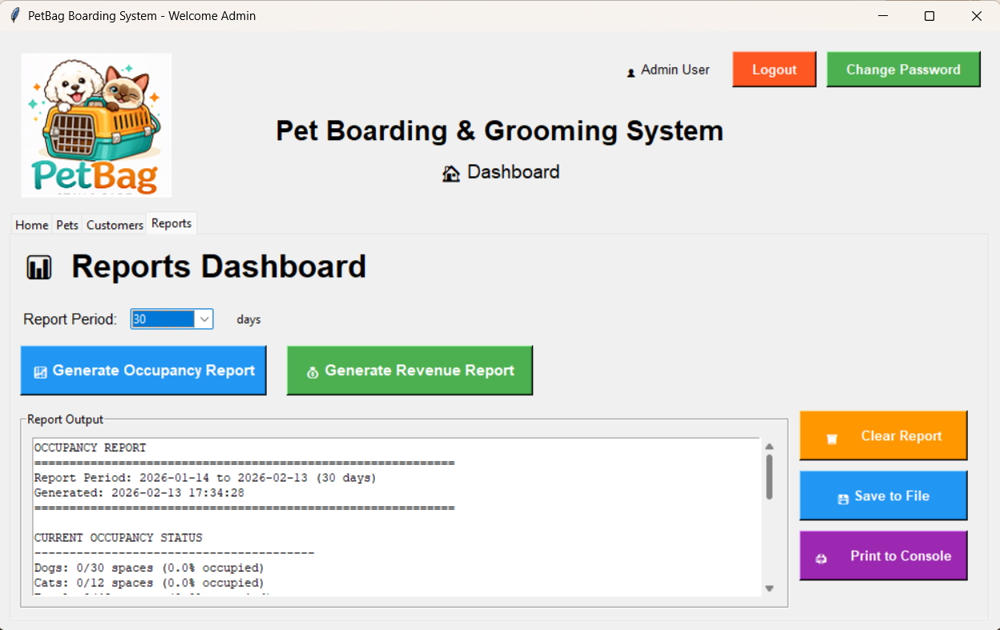

# ePortfolio
### Introduction
_My name is Yana Burlak, I'm and SNHU student working on ePortfolio. Here I'll show case my work in several enchansmnets divided in three distict phases: Software Design and Engineering, Algorithms and Data Structures and Databases._,

The original project that I will be improving is **PetBag Boarding and Grooming System**. It was part of IT-145 Introduction to Scripting developed in Java Programming language. 

Please follow the YouTube video link to see shortcommings of the code that was able to indentify:

[Code Review link](./another-page.html).

```
ORIGINAL CODE & USER VIEW
```
Original PetBag Application was the prompt based system, asking user series of questions before accepting pet into the facility:


[Original Java Code](https://github.com/yburlak/ePortfolio/blob/master/Pet.java).


```
ARTIFACTS
```

### Phase One: Software Design and Engineering

> The main goal for this enhansment phase was to demostrate my ability to transfer code from one programming language to another along with creating intreactive user interface. I went ahead and created persistant data structure via mySQL workbench to support UI functinalites, but it this stage I was far from implementing everything I wanted to incllude to make appliction fully meet needs of small bussness in checkingin/checkingout pets and produce reporting.

Below is UI of the system that was created with help of Tkinter and Phython programming language:


PetBag Application included following elements to make navigation intuitive and easy for empoyes:

- Logo design to promote PetBag brand
- Tabs to support essential functionalies
  - Home tab for quick ations such as booking and ending stay
  - Boarding space availability
  - Pet managment
  - Customers managmnet
  - Reporting (Occupacy and Revenue)
  
### Phase Two: Algorithms and Data Structures

> In this enhansment phase, I concentrated on comprehansive calculations of grooming services, long with space availblity tracking and reporting.
>
> I inroduces lists for dogs weight and prising, where as original code would charge flat fee reardless of the size of the dog. 

```python
# pricing tiers via list data structures
class BoardingService:
    TOTAL_DOG_SPACES = 30
    TOTAL_CAT_SPACES = 12   
    # boarding prices per day
    BOARDING_PRICES = {
        'dog': 30,
        'cat': 25
    }  
    # grooming price tiers by weight for dogs
    GROOMING_PRICES = {
        'small': {'min': 2, 'max': 20, 'price': 50},
        'medium': {'min': 21, 'max': 50, 'price': 70},
        'large': {'min': 51, 'max': 100, 'price': 90},
        'extra_large': {'min': 101, 'max': float('inf'), 'price': 110}
```
I created functions that would communicate with database to get available spaces:

```sql
# get occupancy from the db by counting pets with no check-out date
    @staticmethod
    def get_occupied_spaces(db):
        cursor = db.connection.cursor()
        cursor.execute("""
            SELECT p.pet_type, COUNT(*) as count 
            FROM Boarding b
            JOIN Pet p ON b.pet_id = p.pet_id
            WHERE b.check_out IS NULL
            GROUP BY p.pet_type
        """)
        results = cursor.fetchall()
        cursor.close()
        
        occupied = {'dog': 0, 'cat': 0}
        for pet_type, count in results:
            occupied[pet_type.lower()] = count
        
        return occupied
```
And finally, reporting tab was completed at this stage of the development, here is the sample of generated rort:



### Phase Three: Databases

```js
// Javascript code with syntax highlighting.
var fun = function lang(l) {
  dateformat.i18n = require('./lang/' + l)
  return true;
}
```

```ruby
# Ruby code with syntax highlighting
GitHubPages::Dependencies.gems.each do |gem, version|
  s.add_dependency(gem, "= #{version}")
end
```

### Header 4


##### Header 5

1.  This is an ordered list following a header.
2.  This is an ordered list following a header.
3.  This is an ordered list following a header.

###### Header 6

| head1        | head two          | three |
|:-------------|:------------------|:------|
| ok           | good swedish fish | nice  |
| out of stock | good and plenty   | nice  |
| ok           | good `oreos`      | hmm   |
| ok           | good `zoute` drop | yumm  |

### There's a horizontal rule below this.

* * *

### Here is an unordered list:

*   Item foo
*   Item bar
*   Item baz
*   Item zip

### And an ordered list:

1.  Item one
1.  Item two
1.  Item three
1.  Item four

### And a nested list:


### Small image


### Large image


### Definition lists can be used with HTML syntax.

<dl>
<dt>Name</dt>
<dd>Godzilla</dd>
<dt>Born</dt>
<dd>1952</dd>
<dt>Birthplace</dt>
<dd>Japan</dd>
<dt>Color</dt>
<dd>Green</dd>
</dl>

```
Long, single-line code blocks should not wrap. They should horizontally scroll if they are too long. This line should be long enough to demonstrate this.
```

```
The final element.
```
