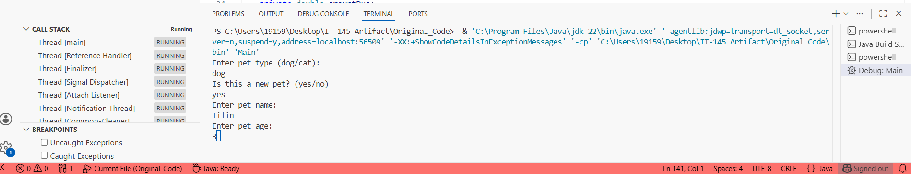

# ePortfolio
## Introduction
_My name is Yana Burlak, I'm and SNHU student working on ePortfolio. Here I'll show case my work in several enchansmnets divided in three distict phases: Software Design and Engineering, Algorithms and Data Structures and Databases._,

The original project that I will be improving is **PetBag Boarding and Grooming System**. It was part of IT-145 Introduction to Scripting developed in Java Programming language. 

Please follow the YouTube video link to see shortcommings of the code that was able to indentify:

[Code Review video link](./another-page.html).

```
ORIGINAL CODE & USER VIEW
```
[Java File](https://github.com/yburlak/ePortfolio/blob/master/Pet.java).



As you can see PetBag application was the prompt based system, asking user series of question before accepting pet into the facility


```
ARTIFACTS
```

## Phase 1

This is a normal paragraph following a header. GitHub is a code hosting platform for version control and collaboration. It lets you and others work together on projects from anywhere.

## Phase 2

> This is a blockquote following a header.
>
> When something is important enough, you do it even if the odds are not in your favor.

## Phase 3

```js
// Javascript code with syntax highlighting.
var fun = function lang(l) {
  dateformat.i18n = require('./lang/' + l)
  return true;
}
```

```ruby
# Ruby code with syntax highlighting
GitHubPages::Dependencies.gems.each do |gem, version|
  s.add_dependency(gem, "= #{version}")
end
```

#### Header 4

*   This is an unordered list following a header.
*   This is an unordered list following a header.
*   This is an unordered list following a header.

##### Header 5

1.  This is an ordered list following a header.
2.  This is an ordered list following a header.
3.  This is an ordered list following a header.

###### Header 6

| head1        | head two          | three |
|:-------------|:------------------|:------|
| ok           | good swedish fish | nice  |
| out of stock | good and plenty   | nice  |
| ok           | good `oreos`      | hmm   |
| ok           | good `zoute` drop | yumm  |

### There's a horizontal rule below this.

* * *

### Here is an unordered list:

*   Item foo
*   Item bar
*   Item baz
*   Item zip

### And an ordered list:

1.  Item one
1.  Item two
1.  Item three
1.  Item four

### And a nested list:

- level 1 item
  - level 2 item
  - level 2 item
    - level 3 item
    - level 3 item
- level 1 item
  - level 2 item
  - level 2 item
  - level 2 item
- level 1 item
  - level 2 item
  - level 2 item
- level 1 item

### Small image


### Large image


### Definition lists can be used with HTML syntax.

<dl>
<dt>Name</dt>
<dd>Godzilla</dd>
<dt>Born</dt>
<dd>1952</dd>
<dt>Birthplace</dt>
<dd>Japan</dd>
<dt>Color</dt>
<dd>Green</dd>
</dl>

```
Long, single-line code blocks should not wrap. They should horizontally scroll if they are too long. This line should be long enough to demonstrate this.
```

```
The final element.
```
